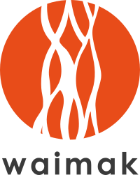

# Waimak



Waimak is an open-source framework that makes it easier to build, test and deploy complex data flows in Apache Spark.

Traditional approaches to data engineering on RDBMs tend to process large volumes of data in highly-dependent waves. Prior waves must finish before the next begin. This creates a problem on distributed Big Data systems as it leaves valuable resources sitting idle but locked. The more complex is the flow of data, the worse the problem gets.

Waimak alleviates this by providing functions that allow a complex flow to be more easily broken up in to independent chunks, within an application. These chunks are labelled to make reuse-without-repetition easier, and deployment to another environment (eg dev vs prod) much simpler.

As a side-effect, it makes collaboration between teams that use data (BI, Data Science) and those that provide data (Data Engineering) less burdensome by encouraging compromise on a common set of Big Data tools. Data users give up some amount of freedom afforded by pure SQL interfaces to Hadoop, but gain the ability to string together sets of data objects defined by Spark SQL and use more native Spark over time. Data providers give up some amount of “optimal computation” but have the business logic owned by those who understand it, on a platform where optimisation is easier to manage.

Our metaphor to describe this framework is the braided river – it splits and rejoins to itself repeatedly on its journey. We chose a particular braided river, the Waimakiriri near Christchurch, New Zealand, as the name and inspiration for the logo.

## Documentation

You can find the latest documentation for Waimak on the [project wiki page](https://github.com/CoxAutomotiveDataSolutions/waimak/wiki). This README file contains basic setup instructions and general project information.

## Getting Started

The following code snippet demonstrates a basic Waimak example taken from the unit tests:

```scala
// Required imports
import com.coxautodata.waimak.dataflow.Waimak
import com.coxautodata.waimak.dataflow.spark.SparkActions._

// Initialise basic Waimak objects
val executor = Waimak.sparkExecutor()
val emptyFlow = Waimak.sparkFlow(spark)

// Add actions to the flow
val basicFlow = emptyFlow
    .openCSV(basePath)("csv_1", "csv_2")
    .alias("csv_1", "items")
    .alias("csv_2", "person")
    .writeParquet(baseDest)("items", "person")

// Run the flow
executor.execute(basicFlow)
```

This example is very small, but in practice flow definitions can become very large depending of the number of inputs and outputs in a job.

The project wiki page provides best practices for structuring your project when dealing with large flows.

## Importing Waimak

You can import Waimak into your Maven project using the following dependency details:

```xml
        <dependency>
            <groupId>com.coxautodata</groupId>
            <artifactId>waimak-core_2.11</artifactId>
            <version>${waimak.version}</version>
        </dependency>
        <dependency>
            <groupId>org.apache.spark</groupId>
            <artifactId>spark-core_2.11</artifactId>
            <version>${spark.version}</version>
            <scope>provided</scope>
        </dependency>
```

Waimak marks the Spark dependency as optional to not depend on any specific release of Spark, therefore you must specify the version of Spark you wish to use as a dependency. Waimak _should_ run on any version of Spark 2.x, however the list of officially tested versions is given below.

Waimak currently consists of the following modules:

Artifact ID | Purpose
----------- | -------
`waimak-core_2.11` | Core Waimak functionality and generic actions
`waimak-azure-table_2.11` | Functionality to write outputs to Azure Tables
`waimak-configuration_2.11` | Non-flow functionality to simplify configuration
`waimak-rdbm-export_2.11` | Functionality to write outputs to MSSQL databases
`waimak-impala_2.11` | Impala implementation of the `HadoopDBConnector` used for commiting labels to an Impala DB
`waimak-rdbm-ingestion_2.11` | Functionality to ingest inputs from a range of RDBM sources
`waimak-storage_2.11` | Functionality for providing a hot/cold region-based ingestion storage layer

## Supported Spark Versions

Waimak is tested against the following versions of Spark:

Package Maintainer | Spark Version
------------------ | -------------
Apache Spark | [2.0.0](https://spark.apache.org/releases/spark-release-2-0-0.html)
Apache Spark | [2.1.0](https://spark.apache.org/releases/spark-release-2-1-0.html)
Apache Spark | [2.2.0](https://spark.apache.org/releases/spark-release-2-2-0.html)
Apache Spark | [2.3.0](https://spark.apache.org/releases/spark-release-2-3-0.html)
Cloudera Spark | [2.2.0](https://www.cloudera.com/documentation/spark2/latest/topics/spark2.html)

Other versions of Spark 2.x are also likely to work and can be added to the list of tested versions if there is sufficient need.

## Contributing

We welcome all users to contribute to the development of Waimak by raising pull-requests. We kindly ask that you include suitable unit tests with along with proposed changes.

### Testing

Waimak is tested against different versions of Spark 2.x to ensure uniform compatibility. The versions of Spark tested by Waimak are given in the `<profiles>` section of the POM. You can activate a given profile in the POM by using the `-P` flag: `mvn clean package -P apache-2.3.0`

The integration tests of the RDBM ingestion module require Docker therefore you must have the Docker service running and the current user must be able to access the Docker service.

## License

Copyright 2018 Cox Automotive UK Limited

Licensed under the Apache License, Version 2.0 (the "License");
you may not use this file except in compliance with the License.
You may obtain a copy of the License at

    http://www.apache.org/licenses/LICENSE-2.0

Unless required by applicable law or agreed to in writing, software
distributed under the License is distributed on an "AS IS" BASIS,
WITHOUT WARRANTIES OR CONDITIONS OF ANY KIND, either express or implied.
See the License for the specific language governing permissions and
limitations under the License.